# Publications, Policy Briefs & Analytical Work

This repository serves as a consolidated archive of selected policy briefs, publications, reports and analytical frameworks authored or co-authored by **Swaraj Singh** during assignments with public sector, multilateral and development institutions.

---

## Author

**Swaraj Singh**  
Policy Research · Public Policy · Development Economics · Trade · Monitoring & Evaluation · Data Analytics  
[GitHub Profile](https://github.com/Swaraj1313)

---

## Featured Work

<strong>📄 Geriatric Care Ecosystems and Caregiver Export Potential</strong> &nbsp;·&nbsp; <em>Policy Brief · SEPC, Ministry of Commerce & Industry</em>

 

### Overview

This policy brief examines India's opportunities in the emerging global care economy against the backdrop of ageing demographics and growing international demand for caregiving services. The brief discusses ecosystem gaps, skilling requirements and policy interventions to strengthen India's position in this sector.

Subsequent policy discussions on the care economy culminated in the announcement of a national **Care Ecosystem initiative in the Union Budget 2026–27** (Para 54 of the Budget Speech).

### Links

- 📰 [Original Publication — India Serves, Vol. III (SEPC)](https://www.servicesepc.org/upload/media/India%20Serves_VOL%20III_2023_March_8949.pdf)
- 🏛️ [Government of India Budget Reference (PIB)](https://www.pib.gov.in/PressReleaseDetail.aspx?PRID=2236531&lang=1&reg=3)

---

<strong>📊 Technology Readiness Index & Regional Benchmarking Framework</strong> &nbsp;·&nbsp; <em>Analytical Framework · Organisation of Southern Cooperation</em>

 

### Overview

A cross-country impact measurement and intervention-sequencing framework developed during tenure at the Organisation of Southern Cooperation (OSC), covering 28 member states across Africa, Asia, Latin America and the Caribbean.

The framework serves two complementary functions: as an **impact measurement instrument**, establishing a comparable, reproducible baseline for technological readiness against which future progress can be tracked; and as a **decision-support model**, producing country-specific, cluster-relative Priority Matrices that translate composite scores into actionable intervention sequencing.

> *This is a redacted version. Indicator identities and source attributions are masked. The full methodological pipeline and one worked country snapshot (Afghanistan) are preserved.*

---

### Methodological Pipeline

The framework is structured as a sequential analytical pipeline:

| Stage | Method | Purpose |
|---|---|---|
| Data Preprocessing | Z-score standardisation + MICE iterative imputation | Normalise scales; handle missing data without listwise deletion |
| Clustering | Gaussian Mixture Model (GMM) | Probabilistic soft-assignment of countries into readiness tiers |
| Validation | One-way ANOVA per indicator | Confirm clusters capture genuine structural differentiation |
| Weighting | PCA-derived weights (PC1 loadings) | Data-driven indicator importance; avoids arbitrary equal weighting |
| Scoring | Pillar composite + overall composite | Aggregated country scores across three thematic pillars |
| Output | Priority Matrix (cluster-relative gap analysis) | Intervention sequencing by pillar, anchored to peer cluster |

---

### Three Thematic Pillars

| Pillar | What it Captures |
|---|---|
| Technology Infrastructure & Access | Digital connectivity, e-government, cybersecurity and population-level penetration |
| Innovation Ecosystem | Productive capacity, R&D intensity, human capital and education investment |
| Policy & Regulatory Environment | Business environment, emerging-tech regulation and enabling conditions |

---

### Cluster Structure

A three-component GMM identifies three distinct tiers of technological readiness across the 28 member states:

- **Cluster 0 — Advanced**: Mature digital infrastructure, established innovation policy and stable regulatory environments. Includes Türkiye, Costa Rica, Tunisia, Jordan, Botswana and Côte d'Ivoire.
- **Cluster 1 — Transitional**: Moderate average performance with substantial intra-cluster variance; requires disaggregated intervention design. Includes Palau, Guyana, Cambodia and Eswatini.
- **Cluster 2 — Foundational**: Limited digital infrastructure, low R&D intensity and underdeveloped regulation. Concentrates in Horn of Africa and Sahel. Includes Afghanistan, Somalia, Yemen and Niger.

---

### Visualisations

🗺️ Geographic Distribution of Clusters

 

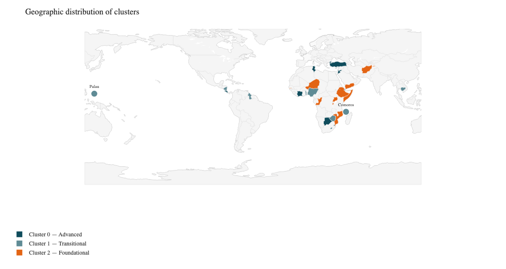

The Advanced tier (Cluster 0) is broadly distributed across Latin America, West Africa, Southern Africa and MENA. The Foundational tier (Cluster 2) concentrates heavily in the Horn of Africa and the Sahel. The Transitional tier (Cluster 1) is the most geographically dispersed, spanning the Pacific, Caribbean, Southeast Asia and Southern Africa.

🔵 GMM Clusters in 2D PCA Space

 

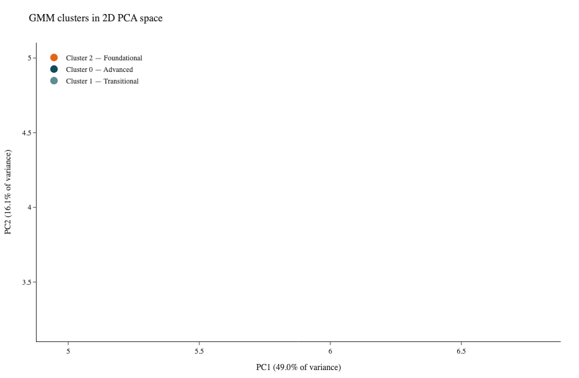

PC1 and PC2 together capture approximately 65% of total variance across the indicator set. The three clusters separate cleanly along PC1, interpretable as a composite axis of overall technological readiness, with Cluster 0 occupying the upper-right region and Cluster 2 the lower-left. This visual separation serves as a robustness check confirming the GMM clustering captures genuine structure.

🌡️ Heatmap of Country Rankings Across Pillars

 

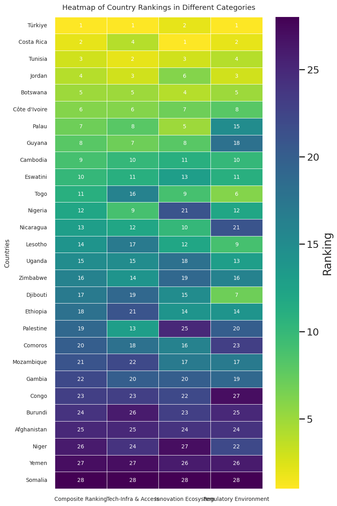

Country rankings on each pillar and the overall composite surface the tiered structure at a glance. The top stratum, Türkiye, Costa Rica, Tunisia, Jordan, Botswana and Côte d'Ivoire, leads consistently across all four ranking dimensions. Between the poles, ranking divergence is the analytically relevant signal: a country ranked 7th overall but 15th on Regulatory Environment (Palau) presents a fundamentally different intervention profile than one with uniformly middling scores.

🔗 Correlation Heatmap of PCA-Weighted Scores

 

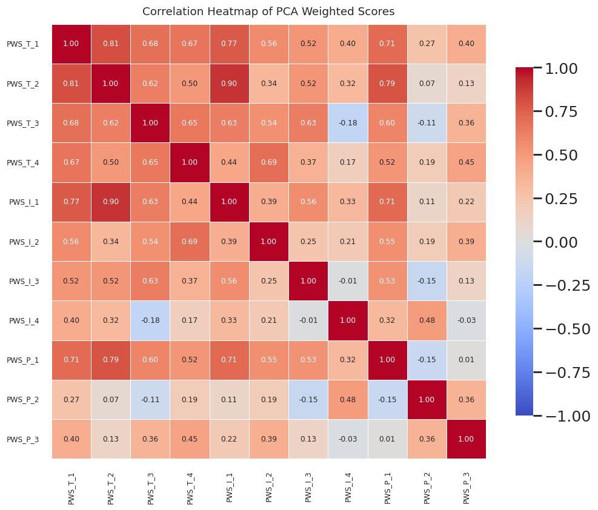

The strongest correlation in the matrix is between T_2 and I_1 (r = 0.90), reflecting the deep complementarity between digital penetration and broader productive capacity. Cross-pillar correlations are mostly positive but moderate, confirming the three pillars are related but not redundant, a desirable property for a multidimensional composite index.

📉 ANOVA Validation — p-values per Indicator

 

Nine of eleven indicators reject the null at p < 0.05, with seven rejecting at p < 0.001. The two non-significant indicators (I_4 and P_2) are retained on substantive grounds, both are analytically important even where they do not strongly differentiate between clusters. Crucially these same two indicators also carry the lowest PCA-derived weights, confirming consistency between two independent diagnostics.

🌐 PCA-Weighted Scores Across All Countries

 

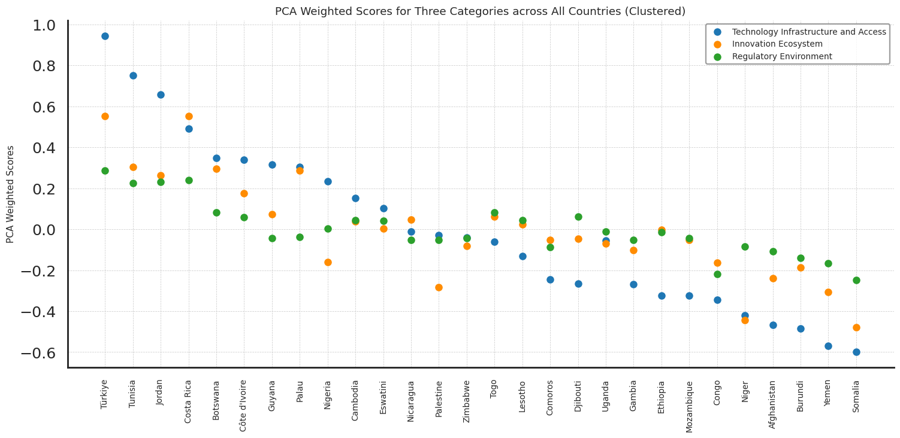

This scatter view provides a multi-dimensional perspective on technological readiness across the country set, segmented into the three pillars. Countries such as Türkiye and Costa Rica show pillar-uniformity, elevated and consistent across all three dimensions. Countries such as Palau and Côte d'Ivoire show pillar-divergence, with Technology Infrastructure substantially outpacing other pillars.

〰️ Parallel Coordinates Plot — All Countries Across Three Pillars

 

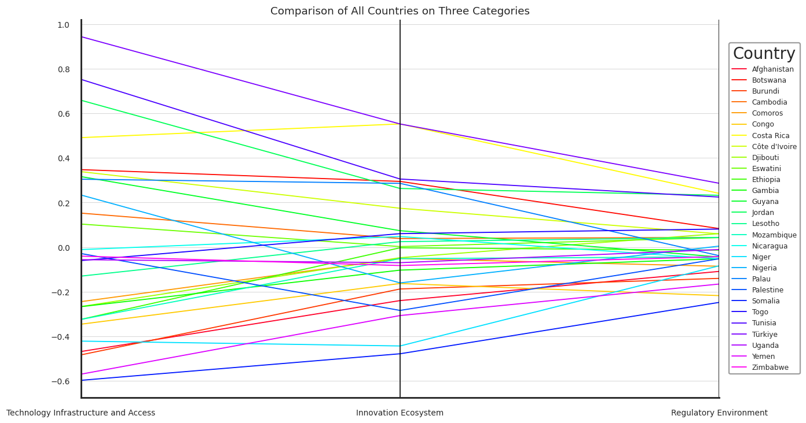

An unmistakable convergence-divergence pattern emerges: countries spread most widely on Technology Infrastructure & Access, narrow somewhat on Innovation Ecosystem and converge tightly on Regulatory Environment. This suggests member states show greater institutional convergence at the policy level than at the infrastructural level, with implications for where differentiated versus harmonised interventions are most appropriate.

🌳 Tree Map of Cluster Distribution

 

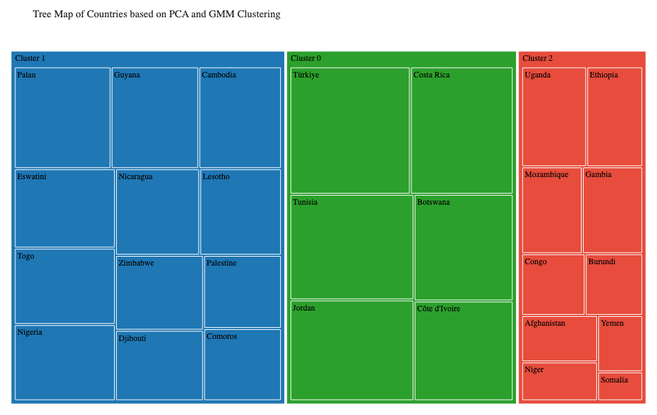

A proportional view of cluster membership across the 28 member states, illustrating the relative size of each readiness tier and the distribution of countries within them.

---

### Country Snapshot — Afghanistan (Cluster 2: Foundational)

📋 Indicator Scorecard & Priority Matrix

 

Afghanistan sits at or below the median of its cluster peers on most indicators, with particularly weak positioning on Technology Infrastructure. The Priority Matrix identifies the following sequencing:

| Priority Level | Pillar |
|---|---|
| 🔴 Immediate | Technology Infrastructure & Access |
| 🟡 Medium | Innovation Ecosystem |
| 🟢 Low | Policy & Regulatory Environment |

The interpretation is cluster-relative: even though Afghanistan trails on all three pillars in absolute terms, the largest gap to its Cluster 2 peers is on the Technology Infrastructure dimension, indicating where peer-anchored intervention is both most consequential and most feasible.

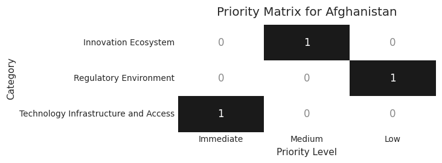

📡 Radar Profile — Afghanistan vs All Cluster Averages

 

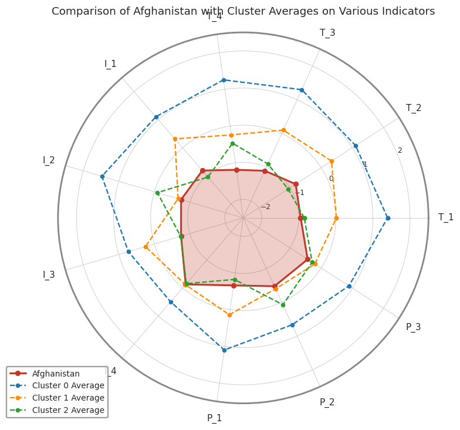

Afghanistan's profile sits well inside the Cluster 0 boundary across every indicator and remains inside or close to the Cluster 2 boundary on most dimensions. The profile shape highlights relative compactness of underperformance, the country is broadly weak across the indicator set rather than catastrophically weak on a few dimensions. This favours broad-spectrum capacity-building over narrowly targeted single-sector interventions.

📦 Intra-Cluster Position — Afghanistan Within Cluster 2 Peers

 

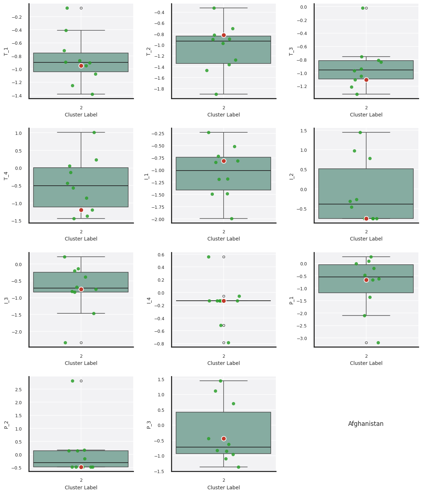

This view situates Afghanistan within its own cluster, showing the distribution of indicator scores across all Cluster 2 members. Afghanistan sits at or below the cluster median on most indicators, with particularly weak positioning on T_4 (lowest in the cluster) and comparatively stronger positioning on I_4 (close to the cluster median).

📈 Comparison with Cluster Averages — Pillar Level

 

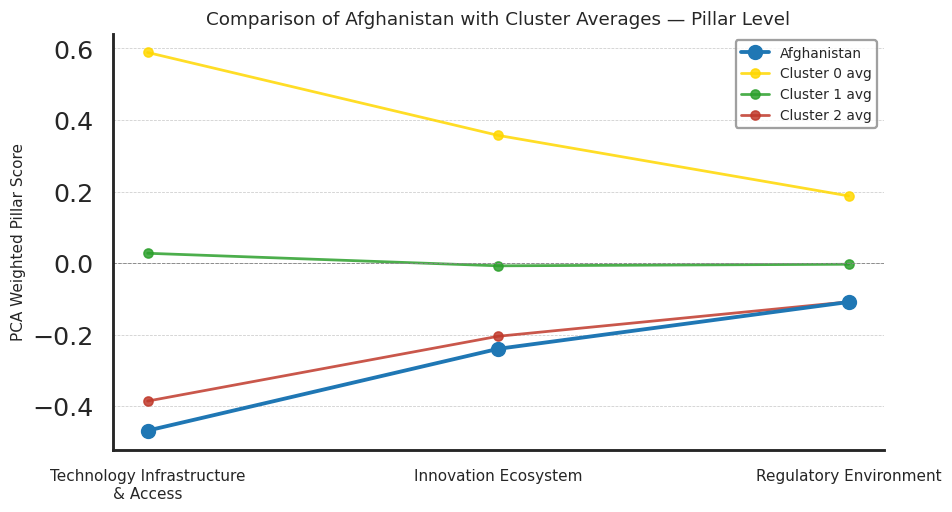

---

### Member States Covered

Afghanistan · Botswana · Burundi · Cambodia · Comoros · Congo · Costa Rica · Côte d'Ivoire · Djibouti · Eswatini · Ethiopia · Gambia · Guyana · Jordan · Lesotho · Mozambique · Nicaragua · Niger · Nigeria · Palau · Palestine · Somalia · Togo · Tunisia · Türkiye · Uganda · Yemen · Zimbabwe

---

*For queries or collaboration, contact via [GitHub](https://github.com/Swaraj1313).*
